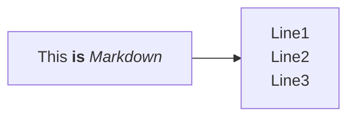

# 交通科学与工程学院

包含交通科学与工程学院的相关资料。123123

<!--@include: @/parts/wip.md-->

## 资料下载

<OList path="/交通科学与工程学院" />

:::details
强调用户在快速浏览文档时也不应忽略的重要信息。
:::

:::tip
This is an info box**.**

1q2131
:::

When $a \ne 0$, there are two solutions to $(ax^2+bx+c=x^2)$ and they are

$$
x={-b \pm\sqrt{b^2-4ac} \over2a}\cdot x^2|x|+\sum_1^11\cdot\lambda
$$

**Maxwell's equations:**

| equation | description |
| --- | --- |
| $\nabla \cdot \vec{\mathbf{B}}  = 0$ | divergence of $\vec{\mathbf{B}}$ is zero |
| $\nabla \times \vec{\mathbf{E}}\, +\, \frac1c\, \frac{\partial\vec{\mathbf{B}}}{\partial t}  = \vec{\mathbf{0}}$ | curl of $\vec{\mathbf{E}}$ is proportional to the rate of change of $\vec{\mathbf{B}}$ |
| $\nabla \times \vec{\mathbf{B}} -\, \frac1c\, \frac{\partial\vec{\mathbf{E}}}{\partial t} = \frac{4\pi}{c}\vec{\mathbf{j}}    \nabla \cdot \vec{\mathbf{E}} = 4 \pi \rho$ | *wha?* $x^2$ |



[abc](https://example.com)

::: code-group
```ts [File 2] :line-numbers
21312321312


123123123 // [!code highlight]


123123123 // [!code ++]

123123123
```
```js [File 2213]
2131231


1231231233 // [!code warning]


11231231 // [!code error]


13123123


123123
```
:::

> 1232131231231231231231231231
> 
> 123123
> 
> > 123123213
> 
> 12312312
> 
> 123

> 123123
> 
> > 12312313
> 
> > 12312312
> 
> 12312312

1231231

> 12312312
> 
> > 123213
> > 
> > > q123
> > 
> > > 123123

- 123123
  - 12312312

- 12313213

- 123213123

> 123123

> 12312312
